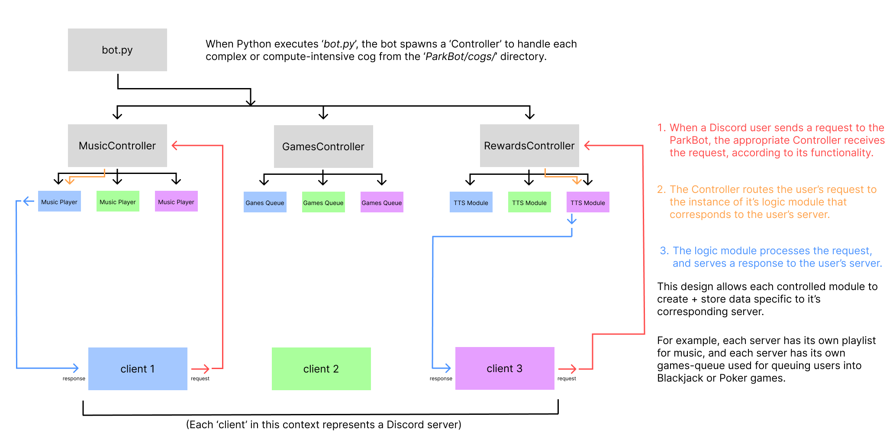

<p align="center">
  
</p>

ParkBot is a Discord bot written in Python with the objective of bringing fun to your discord servers! Features include playing music, games to play by yourself or with other users, an economy, and more!

## project organization
<p align="center">
  
</p>

<p align="center"> disclaimer - the music cog no longer uses the Controller architecture </p>

## setting up and running your discord bot instance -
### pre-requisites
* python 3.10 or newer installed
* tested on windows 11 and Ubuntu Linux 22.04 LTS

### easy setup option - setup.sh
* open a bash-compatible terminal with admin privileges
* enter the ParkBot root directory, ```cd <parkbot-root>```
* run the `setup.sh` bash script, ```. setup.sh```
* wait for the script to install python packages then external dependencies including java 17, lavalink, and non-sucking-service-manager for windows users
* when prompted, enter the password you would like to set for your lavalink server (lavalink helps serve your discord bot music)
* then you will be prompted for what port you would like lavalink to serve (any integer between 1 and ~60000) + make sure the port you chose isn't already in use by your system.
* enter the required fields in the config GUI, and now your bot should be ready for action.
* this script has installed two services on your system, 'ParkBotService' / 'parkbot.service' and "LavalinkService" / 'lavalink.service'. (windows / linux naming)
* linux users -
    * start and stop your services using `sudo systemctl start parkbot` and `sudo systemctl stop lavalink`. to see the status of your services, use `sudo systemctl status parkbot`.
    * remember that the lavalink service must be running in order for parkbot to serve music.
* windows users -
    * start and stop your services in the cli using `sc start LavalinkService` or `sc stop ParkBotService`. use `sc query ParkBotService` to see the status of a service. alternatively, use the 'Services' app on Windows to view + manage your services in a GUI.

### Manual Setup Instructions below

#### You will want to begin by creating a virtual environment for this project, if you don't already have one.
* Open a terminal in the `ParkBot` directory
#### using a linux style terminal, such as git bash for windows, or bash on linux
* create your virtual environment, ```$  python -m venv .venv```
* activate your virtual environment,
    * windows git bash users - ```$  source .venv/Scripts/activate ```
    * linux bash users - ```$  source .venv/bin/activate ```
#### now, we will install the project dependencies
* in your activated terminal, install pip dependencies -
    * windows git bash users - ```.venv/Scripts/python.exe -m pip install -r requirements.txt```.
    * linux bash users - ```.venv/bin/python -m pip install -r requirements.txt```
* you have now installed python dependencies necessary for this project. pat yourself on the back

#### install some external dependencies now -
* you will need java 17 installed on your machine - [here](https://www.openlogic.com/openjdk-downloads?field_java_parent_version_target_id=807&field_operating_system_target_id=All&field_architecture_target_id=All&field_java_package_target_id=All) are the downloads OR let the setup.sh script do it for you
* you will need lavalink downloaded, preferably in your parkbot directory like this - `<parkbot_root>/lavalink/lavalink.jar`. [here](https://github.com/lavalink-devs/Lavalink/releases) is the lavalink releases, find version 4.0.0. there will be an 'assets' subtab under this version where you can click to download `lavalink.jar`.
* you will need a lavalink 'application.yml' file. you can download/copy a default one from lavalink's github [here](https://github.com/lavalink-devs/Lavalink/blob/c2431ce1b1aab088aff29033b2e44bb840fd5cd1/LavalinkServer/application.yml.example). you will want to change the 'address' value to 127.0.0.1 instead of 0.0.0.0. this is because a value of 0.0.0.0 is a security concern. you will also want to change the 'password' value for security reasons. I like to change the port as well, although its not necessary. finally, you will need to copy your lavalink address + port values, and paste them into your bot.config file as `lavalink_uri = http://address:port`. example: `lavalink_uri = http://127.0.0.1:5400`. then, copy your new lavalink password and paste it as the value for bot.config's `lavalink_pass` key. also, don't forget to change the name of this file from `application.yml.example` to `application.yml`, and move it into the `<parkbot_root>/lavalink` directory, where you should also store your lavalink.jar.

#### manually installing services 
* this is a pain in the ass to go through - again I will recommend you use the setup.sh script which will do this for you. however I will provide some information for those who wish to do this manually.
    * windows users - you will need to download non-sucking-service-manager. [here](https://nssm.cc/) is their page with download + documentation. it's rather slow so be patient when accessing it. another useful link is [here](https://www.devdungeon.com/content/run-python-script-windows-service). this link goes over how to install a python script as a service. you can replicate the steps he goes through in order to also create a service from java and lavalink.jar. it seems I have also written a tutorial in the past if you continue to scroll down to the section 'self hosting your bot instance as a windows service'.
    * linux users - review [systemd documentation](https://www.freedesktop.org/software/systemd/man/latest/systemd.unit.html) or google how to create a systemd service

#### now, to configure your project. 
when using the setup.sh script, or after running the config-wiz.py, a file called "bot.config" will be created. this file stores sensitive data such as API tokens. treat it with caution. below, I've listed the necessary and non-necessary values that your 'bot.config' file must contain.

* NECESSARY for all instances - obtain a discord api token [here](https://discord.com/developers/applications), create a discord 'application', and also create a 'bot' from the discord developer portal. before adding the bot to your server, be sure to give it permissions to view all guild memebers, view messages, send messages, send private threads, and view/ join voice channels. enter your discord api token in the 'bot.config' file next to the line `token = `.

* for the MUSIC FEATURE - you will need provide information about your lavalink server, as `lavalink_uri` and `lavalink_pass`. these fields will automatically be populated if you use the setup.sh script. otherwise, follow steps in the section "install some external dependencies now" to manually install and configure lavalink.

* for the CANVAS FEATURE - you will need to obtain a canvas API key. this can easily be done by going to your account settings in canvas, where you are given the option to generate a new access token. once you have this token, paste it into the quotations next to `CANVAS_API_TOKEN`.

### to run / test your bot

* to test your bot, open a terminal in the ParkBot directory,
* activate your virtual environment, then run 'bot.py'.
    * windows git bash users - `source .venv/Scripts/activate` then `python bot.py`
    * linux bash users - `source .venv/bin/activate` then `python bot.py` 
*  alternatively, skip activating your virtual environment and simply reference the python executable inside your venv.
    * windows git bash users - `.venv/Scripts/python.exe bot.py`
    * linux bash users - `.venv/bin/python bot.py`
* the bot logs runtime errors and information at `<parkbot_root>/discord.log` and info/errors surrounding the music cog at `<parkbot_root>/music.log`.
    * using a bash style terminal, you can view these logs using a command, `tail -f discord.log` or `tail -f music.log`. cat can be used as well, but tail gives you the ability to see live updates to the file.

## self-hosting your bot instance as a windows service
there are a couple ways to do this. I have done it using a tool called the NSSM, or "non-sucking-service-manager". its a simple command line tool that lets us turn a python script into a windows service. you can download that project [here](https://nssm.cc/download). once you have downloaded it, copy the `nssm.exe` file to the ParkBot root directory.

* open a terminal in the ParkBot directory, and activate your virtual environment. ensure all your requirements are installed already and the bot is functional.

* the syntax for creating a python service with nssm is like this - ```nssm install "NameYouWantToGiveYourService" "path\to\the\python\executable\you\want\to\use.exe" "path\to\the\python\file\you\want\the\executable\to\execute\on.py"```.
  
* so, in our use case, naming the service 'ParkBotService', the command would look like this (notice i'm executing the command from the ParkBot directory) - ```C:\...\ParkBot> nssm install "ParkBotService" ".venv\Scripts\python.exe" "bot.py"```. i don't remember whether this worked with relative paths, so if it fails then run the same command, but use absolute paths instead of relative.

* to ensure your service has the proper working directory, you should also execute this command - ```nssm set ParkBotService AppDirectory <ParkBot/root/directory/on/your/machine>```

* if your service creation was a success, find the `Services` program on windows search, then find your service there. Go ahead and boot it up, and feel free to tinker with the settings of the service, such as what you want the service to do upon crashing or a failure.

## Congrats! You are now hosting your own discord bot.

## dall-e-mini set up below

* to set up AI image generation for the parkbot, you will need to visit [replicate](https://replicate.com/), sign up, and create an API token. you will need to add the token you create to your existing persisting environment variables under the key, REPLICATE_API_TOKEN. after you've done this and refreshed your terminal or restart your machine, you should be able to use ParkBot's replikate cog. For more detailed instructions, view [replicate's python API guide](https://replicate.com/docs/get-started/python#authenticate).
