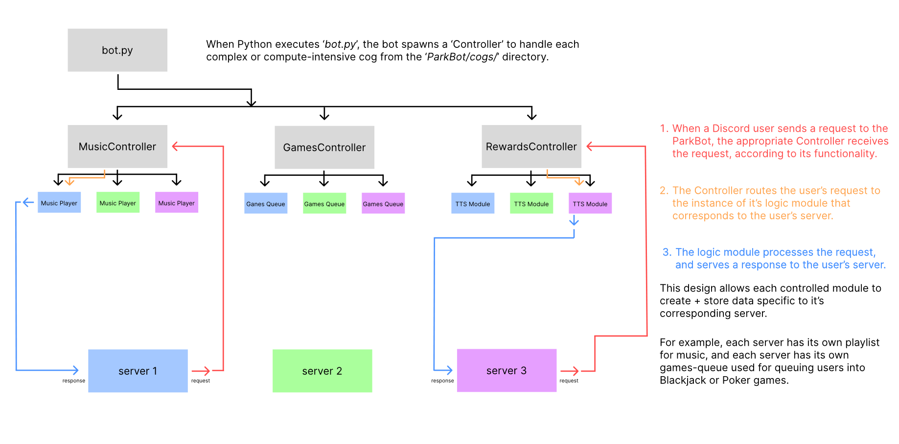

<p align="center">
  
</p>

ParkBot is a Discord bot written in Python with the objective of bringing fun to your discord servers! Features include searching, playing, and even autoplaying music; games to play by yourself or with other users, an economy, and more!

## project organization
<p align="center">
  
</p>

## setting up and running your discord bot instance -
### pre-requisites
* python 3.10 or newer installed
* only tested on windows 11

#### You will want to begin by creating a virtual environment for this project, if you don't already have one.
* Open a terminal in the `ParkBot` directory
#### using command prompt
* create your virtual environment, ```C:\...\ParkBot> python -m venv .venv```
* activate your virtual environment, ```C:\...\ParkBot> .venv\Scripts\activate.bat``` (this may require an elevated command prompt)
#### using a linux style terminal, such as git bash for windows
* create your virtual environment, ```$  python -m venv .venv```
* activate your virtual environment, ```$  .venv/Scripts/activate ```
#### now, we will install the project dependencies
* in your activated terminal, from the ParkBot directory, use this command, ```.venv/Scripts/python.exe -m pip install -r requirements.txt```. specifying the exact python executable we want to use ensures that we don't accidentally install the dependenies to your system's global python installation.

#### now, to configure your project. 

I have provided an example config file in config/example_config.py. you can rename this file to simply `config.py`, then populate it's contents. the project's .gitignore is set to not track any files names config.py, which should prevent you from pushing any sensitive data. however, you should still take precautions not to expose any of your API keys whenever possible.

* NECESSARY for all instances - obtain a discord api token [here](https://discord.com/developers/applications), create a discord 'application', and also create a 'bot' from the discord developer portal. before adding the bot to your server, be sure to give it permissions to view all guild memebers, view messages, send messages, send private threads, and view/ join voice channels.

* for the MUSIC FEATURE -  you wil need to download FFMPEG, [here](https://www.gyan.dev/ffmpeg/builds/). FFMPEG downloads are zipped in .7z format, so you will need a third party archiving software such as 7-zip or winrar in order to extract the FFMPEG contents. the only piece you need from this download, is the `ffmpeg.exe`. you will need to copy this executable then store in somewhere on your computer. after you have saved this executable somewhere, you will need to copy the path to `ffmpeg.exe`. you will then open up `config.py`, and paste the path in the quoatations next to the variable, `FFMPEG_PATH`. now your discord bot knows where to find FFMPEG for use in audio processing.

* for the MUSIC FEATURE - you'll also need a YouTube API key. you can find details on obtaining a youtube-data API key [here](https://developers.google.com/youtube/v3/getting-started). once you have registered an application there and obtained your google/youtube API key, you can paste your key in the config/config.py file, in the quotations next to `GOOGLE_API_KEY`.

* for the CANVAS FEATURE - you will need to obtain a canvas API key. this can easily be done by going to your account settings in canvas, where you are given the option to generate a new access token. once you have this token, paste it into the quotations next to `CANVAS_API_TOKEN`.

### to run / test your bot

* to test your bot, open a terminal in the ParkBot directory, and activate your virtual environment. then use this command to run the bot, `.venv/Scripts/python.exe bot.py`.

## self-hosting your bot instance as a windows service

there are a couple ways to do this. I have done it using a tool called the NSSM, or "non-sucking-service-manager". its a simple command line tool that lets us turn a python script into a windows service. you can download that project [here](https://nssm.cc/download). once you have downloaded it, copy the `nssm.exe` file to the ParkBot directory.

* open a terminal in the ParkBot directory, and activate your virtual environment. ensure all your requirements are installed already and the bot is functional.

* the syntax for creating a python service with nssm is like this - ```nssm.exe install "NameYouWantToGiveYourService" "path\to\the\python\executable\you\want\to\use.exe" "path\to\the\python\file\you\want\the\executable\to\execute\on.py"```.
  
* so, in our use case the command would look like this - ```nssm.exe install "ParkBotService" ".venv\Scripts\python.exe" "bot.py"```. i don't remember whether this worked with relative paths, so if it fails then run the same command, but use absolute paths instead of relative.

* if your service creation was a success, find the `Services` program on windows search, then find your service there. Go ahead and boot it up, and feel free to tinker with the settings of the service, such as what you want the service to do upon crashing or a failure.

## Congrats! You are now hosting your own discord bot.

# BIG NOTE - the instructions to set up dall-e-mini below need revision! some of the commands may not be appropriate for your operating system. also, I haven't checked the validity of the replicate links in months so those instructions may be deprecated as well. I will revise them sooner or later

## dall-e-mini set up below

Ever wanted to access Dall-E mini from your own discord server? Look no further! Using the power of replicate API hosting, anyone with a github account can use AI to generate images in discord. Side note: every request to replicate's API uses a token, of which new users have only 15 - 20. Because of that, this bot is limited to sending only 15-20 dall-E-mini generations from each github account it is associated with. NOW, there are benefits of using an API as well. You don't have to use your own local processing power to generate these images, plus replicate is free until you run out of tokens ( as long as you don't enter your card info! ) You will not be able to complete any requests after you are out of tokens. It's not like AWS where you might accidentally get $2 million charged for overdrawing on API tokens. So why not give it a try :D This walkthrough assumes you are using a windows machine, and GitHub desktop installed, in the default location.

**Let's begin with creating a virtual environment**
* Open a cmd terminal in VSCode
* Make sure you're pathed into 'ParkBot'
* 
```cd Documents/GitHub/ParkBot```

* create a virtual environment using python venv library - the first 'venv' is telling windows that's the module we want to call, while the '.venv' is what we are naming our virtual environment

```python3 -m venv .venv```
* activate virtual environment (it may do this automatically. you will know it's activated because your command prompt will have the name of your virtual environment, .venv, in the beginning of every line now)

```.venv\Scripts\activate.bat```

* your virtual environment is ready to work with :) now to install the dependencies required to run the bot. we'll use a command to install all dependencies listed in 'requirements.txt'  

```python3 -m pip install -r requirements.txt```  

Now, if you check .venv/Lib/site-packages, you should see a bunch of libraries which we just installed - including discord and discord.py. If you don't, you probably installed your requirements to your global python environment rather than the virtual environment you just created. This isn't an issue now, but if you want to run other python projects in the future, you will want to look into cleaning up your global python environment. 

**Getting your replicate API token**
* Begin by going to [replicate's website](https://www.replicate.com)

* Sign up using your github account

* Navigate to the top right hand corner where your profile picture is located, and select "account" in the dropdown. 

* Here, you should see 'API TOKEN' blaring at you. generate one if this section is blank.

* Now, go to [this link](https://replicate.com/docs/get-started/python) in the replicate documentation. There should be a subheader `authenticate`, in which there is a command beginning with `export`. Copy this command (it contains your unique API key, and assigns it to an environment variable) and run it in your command prompt terminal. 

* Now you're almost ready!

**If you're unfamiliar with the Discord API**

* To create your discord bot, you will have to follow a few steps on the discord API documentation. Don't forget to invite your bot to your server before trying to run the bot. 

* Most importantly, once you have created your bot, ensuring you have the message sending intention active, you want to locate and copy your discord API token. You'll want to keep this token secret.

* Now that you have your discord API token, you need to store it in a config file. Create a 'config' folder within the 'dall-e-discord-bot' folder. 

* within the config folder you just created, create a file called config.py

* in config.py, you need to write just one line - be sure to replace the string I included with the Discord API token you copied a few steps ago. 

```TOKEN = ABC123DEF456GHI789```

* Now you're just about ready to run your dall-e-mini discord bot!

* Open a command prompt terminal, and be sure to path to your dall-e-discord-bot folder

```cd Documents/GitHub/dall-e-discord-bot```
* Don't forget to activate your virtual environment again

```.venv\Scripts\activate.bat```

* now, run this command to boot up the bot. upon booting up, you should receive a message in your terminal telling you `Hi, I'm logged in as (your bots name).` from here, your bot is online!

```python3 bot.py```

* use the $help command in discord chat to see a list of commands. remember to prefix any commands to this bot with the `$` character. now generate some AI art :D. the requests have generally taken around 30-45 seconds to load in my experience. 

* if an image takes longer than 2 minutes to load, close the terminal where your bot.py script is running. then, open a new terminal and run the last three commands again to get a fresh bot running
